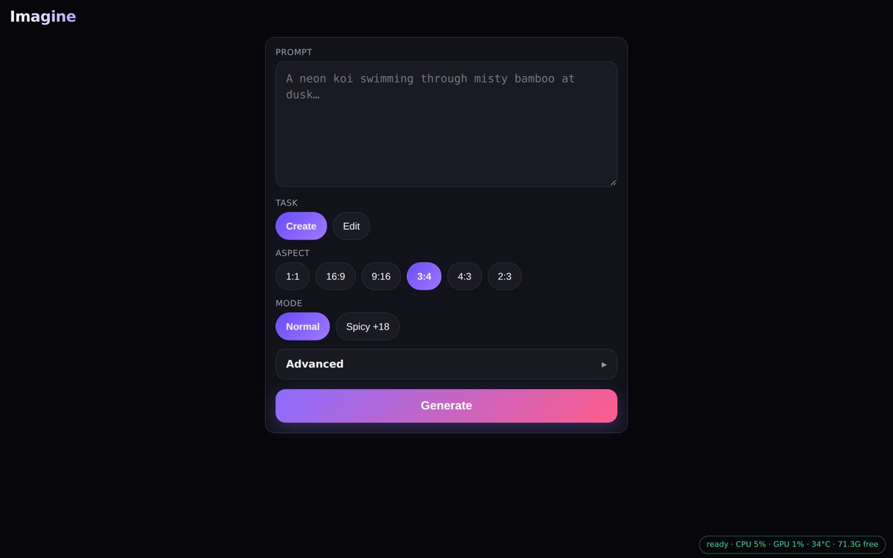
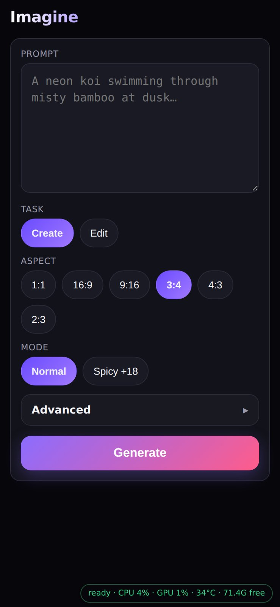
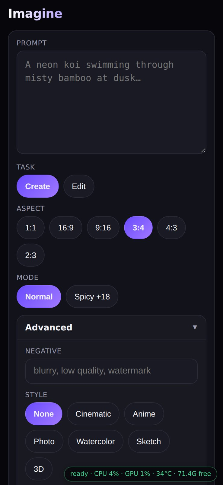
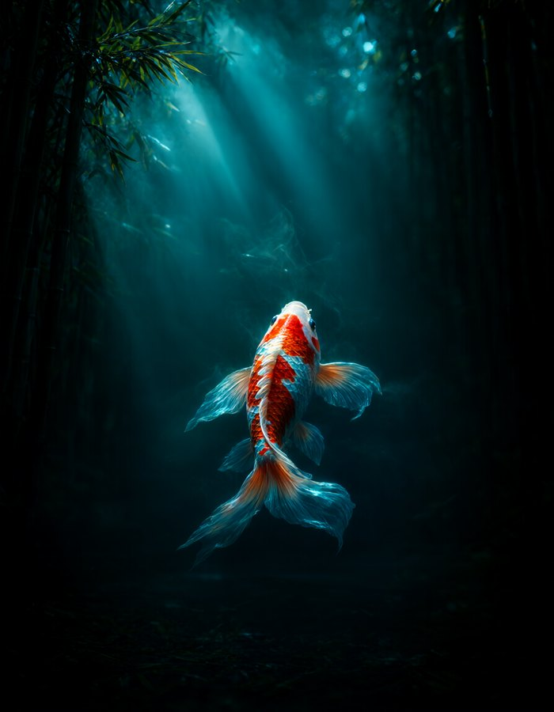
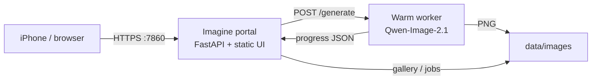

# Imagine

**A Grok-Imagine–style image studio for your own GPU.**

One warm Qwen-Image model. One beautiful mobile web UI. Create, edit, cancel, star — from your phone on the couch.

[](https://github.com/darrenkoh/imagine/stargazers)
[](#license)
[](#)
[](#)

<p align="center">
  
</p>

<p align="center">
  <em>Prompt → warm worker → live progress → gallery.</em><br/>
  <em>iPhone Safari. Tailscale. Self-hosted. No cloud tax.</em>
</p>

---

## Screenshots

<p align="center">
  
  &nbsp;
  
</p>

<p align="center">
  <sub>Mobile compose · Advanced styles &amp; controls</sub>
</p>

### Sample outputs (Qwen-Image-2.1 on DGX Spark)

<p align="center">
  
  &nbsp;
  
  &nbsp;
  
</p>

<p align="center">
  <sub>Cinematic neon koi · Anime robot barista · Photoreal autumn tea house</sub>
</p>

---

## Why this exists

Cloud image apps are fun until the queue, the filter, or the invoice shows up.

**Imagine** is the opposite: a tiny FastAPI portal in front of a *always-warm* Qwen-Image-2.1 worker on your box. Built first for **NVIDIA DGX Spark** and an iPhone in your pocket.

If you want “type a vibe → get a still” on hardware you own, this is that.

---

## Features that feel like a product

| | |
|---|---|
| **Create & Edit** | Text-to-image, or upload a still and steer it with a **Strength** slider |
| **Styles that stick** | Cinematic · Anime · Photo · Watercolor · Sketch · **3D CGI** — prepended + style-specific negatives so the look actually wins |
| **Transparent PNGs** | Official Qwen RGBA prompt path + checkerboard preview |
| **Spicy mode** | Optional +18 bias (adults only) with NSFW blur you can toggle |
| **Framing nudge** | Optional suffix so subjects don’t get cropped at the edges |
| **Live queue** | Real % / step progress, “#N in queue · ~Xs”, and **Cancel** mid-flight |
| **Gallery that scales** | Empty state · star · All / Starred / Spicy / Normal filters · multi-select delete · reuse prompt |
| **Speed path** | Default **28 steps** + optional `torch.compile` on the transformer |
| **Phone-first** | Thumb-sized chips, bottom sheet, safe-area padding, self-signed TLS + `/trust` flow |

---

## Architecture



- **Portal** — pin-gated UI + API, job queue, gallery, uploads  
- **Worker** — one GPU process, model loaded once, lock so only one denoise at a time  
- **Shared `data/`** — images, jobs, progress, uploads (bind-mounted into Docker)

---

## Quick start

### Requirements

- NVIDIA GPU with enough unified/VRAM for **Qwen-Image-2.1** (~31GB weights; Spark’s 128GB UM is comfortable)
- Docker (worker) + Python 3.11+ (portal)
- Weights checked out locally (e.g. Hugging Face `Qwen/Qwen-Image`)

### 1. Clone

```bash
git clone https://github.com/darrenkoh/imagine.git
cd imagine
python -m venv .venv && source .venv/bin/activate
pip install -r requirements.txt
```

### 2. Point at your model + data

```bash
export IMAGINE_MODEL=/path/to/Qwen-Image-2.1
export IMAGINE_DATA="$(pwd)/data"
export IMAGINE_PIN="choose-a-real-pin"
mkdir -p "$IMAGINE_DATA"/{images,jobs,progress,uploads}
```

### 3. Warm the worker (GPU)

```bash
./run_worker.sh          # Docker → :7861, loads the pipeline
# optional: IMAGINE_TORCH_COMPILE=1
```

### 4. Start the portal

```bash
./run_portal.sh          # HTTPS :7860 (self-signed)
# or IMAGINE_HTTP=1 ./run_portal.sh   # cleartext for Tailscale-only
```

Open `https://<your-host>:7860/`, enter your PIN, generate.

Handy scripts:

| Script | Does |
|--------|------|
| `./launch_tmux.sh` | Stop conflicting big models → worker → portal → smoke |
| `./stop_all.sh` | Tear down worker + portal |
| `./run_portal_bg.sh` | Portal in background |

> **Memory tip:** A 70B+ LLM and Qwen-Image usually won’t share a 120GB box. Stop the LLM before warming Imagine.

---

## Phone / Tailscale

1. Join the same Tailscale tailnet as the Spark (or LAN).
2. Open `https://<spark-tailscale-ip>:7860/`.
3. First time: visit `/trust`, install the PEM, enable it in **Certificate Trust Settings** (iOS).
4. Unlock with your PIN.

Built so one-handed prompting actually feels good — not a desktop Gradio crammed into Safari.

---

## API (pin-gated)

| Method | Path | |
|--------|------|--|
| `POST` | `/api/auth` | `{ "pin": "…" }` |
| `POST` | `/api/generate` | prompt, aspect, style, spicy, rgba, framing, steps, seed, optional `image_id` + `strength` |
| `GET`  | `/api/jobs/{id}` | status, pct, queue ahead, ETA |
| `POST` | `/api/jobs/{id}/cancel` | cancel queued/running |
| `GET`  | `/api/gallery` | items (+ starred / nsfw flags) |
| `POST` | `/api/gallery/{id}/star` | toggle star |
| `POST` | `/api/gallery/delete` | `{ "ids": […] }` |
| `POST` | `/api/upload` | edit source image |
| `GET`  | `/api/status` | worker ready, CPU/GPU, free RAM |

Header: `X-Imagine-Pin: <pin>` (or session cookie after `/api/auth`).

---

## Stack

- **Model:** [Qwen-Image-2.1](https://huggingface.co/Qwen) via Diffusers
- **Worker:** FastAPI + CUDA Docker (`torch.compile` optional)
- **Portal:** FastAPI + vanilla JS (no React tax)
- **Target:** NVIDIA DGX Spark · also any box that can hold the weights

---

## Roadmap ideas

PRs welcome — especially if you ship the thing:

- [ ] One-click “Send to video” (I2V handoff)
- [ ] Batch / variation packs from the sheet
- [ ] Shareable public demo mode (read-only gallery)
- [ ] Multi-GPU worker pool

---

## Star if this saved you a weekend

Self-hosted image UX is still weirdly hard. If Imagine scratches the itch, **a star helps other Spark / Qwen folks find it** — and keeps the repo alive.

<p align="center">
  <a href="https://github.com/darrenkoh/imagine/stargazers">⭐ Star darrenkoh/imagine</a>
  ·
  <a href="https://github.com/darrenkoh/imagine/issues">Open an issue</a>
  ·
  <a href="https://github.com/darrenkoh/imagine/fork">Fork it</a>
</p>

---

## License

MIT — use it, fork it, run it on your own iron.
